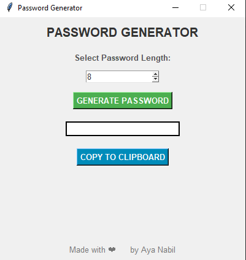

# Password Generator in Python 🔐
**By Aya Nabil**

## 🧐 About the Project  
Rock, Paper, Scissors is a classic hand game where players choose between rock, paper, or scissors, and the winner is determined by a set of simple rules. This project brings the game to life using Python and Tkinter, creating a simple and interactive GUI-based game. It’s a perfect project for beginners to practice Python while having fun!

## 🌟 Why Play When You Can Create?  
Instead of just playing games, let’s create one! This Rock, Paper, Scissors project is designed to help you learn Python basics like **functions**, **user input**, and **random module** in a fun and engaging way. By building this project, you’ll not only improve your coding skills but also have a tool to challenge your friends and family.

## 🧩 Features  
- **User-Friendly GUI:** Built with Tkinter for a simple and intuitive interface.
- **Interactive Gameplay:** Play against the computer and see the result instantly.
- **Reset and Exit Options:** Easily reset the game or exit the application.
- **Beginner-Friendly:** Perfect for learning Python basics like functions, event handling, and GUI development.

---

## 🛠️ Project Prerequisites
Before you start, ensure you have:
- **Basic Python Knowledge**: Familiarity with defining functions, handling user input, and working with strings.  
- **Python Installed**: Ensure Python 3.x is installed on your system.  
- **Tkinter**: Usually comes pre-installed with Python.  

### Python Concepts Used:  
- **Tkinter**: For creating the graphical user interface (GUI).  
- **Functions**: To organize code and handle story generation.  
- **String Formatting**: Using f-strings to dynamically insert user input into stories.
- **Random Module:** To generate the computer’s choice.
- **Event Handling**: Responding to button clicks and user input.  

---

## 📂 Project File Structure  
Here’s a step-by-step breakdown of how this project works:  

1. **Import Required Modules**:  
   - `tkinter`: For creating the GUI (windows, buttons, labels, etc.).
   - `random`: To generate the computer’s random choice.

2. **Define Functions**:  
   - **`computer_choice()`**: Generates the computer’s choice (rock, paper, or scissors).
   - **`play()`**: Compares the user’s choice with the computer’s choice and displays the result.
   - **`reset()`**: Clears the result and user input fields.
   - **`exit_game()`**: Closes the application.

3. **Game Logic**:  
   - The user selects their choice (rock, paper, or scissors).
   - The computer randomly selects its choice.
   - The program compares the choices and displays the result (win, lose, or tie).

4. **Interactive GUI**:  
   - Buttons for **`PLAY`**, **`RESET`**, and **`EXIT`**.
   - A text box to display the result.
---

## 🚀 How to Run the Project

1. **Clone or Download the Repository**:
   ```bash
   git clone https://github.com/1AyaNabil1/Basic-Python-Projects-for-Absolute-Beginners.git
    cd Basic-Python-Projects-for-Absolute-Beginners/03.\ Rock\ Paper\ Scissors
2. **Run the Script:**
   ```bash
   python rock-paper-scissors.py
3. **Follow the Prompts:**
    - Enter your choice (rock, paper, or scissors) in the input field.
    - Click **PLAY** to see the result.
    - Use **RESET** to start a new game or **EXIT** to close the application.
  
---
## 📸 Project Output  

### Example Gameplay:  
1. **Main Window**:  
     

2. **Result Display**:  
   
   
   

---
## 📖 Summary:
**With this project, you’ve learned how to:**
1. Create a simple GUI using Tkinter.
2. Use functions to organize your code.
3. Handle user input and generate random choices.
4. Build a fun and interactive Python project from scratch.
---
## ✨ Credits
This project is proudly developed by `Aya Nabil`.

**Want to explore more beginner-friendly projects? Stay tuned! 😊**