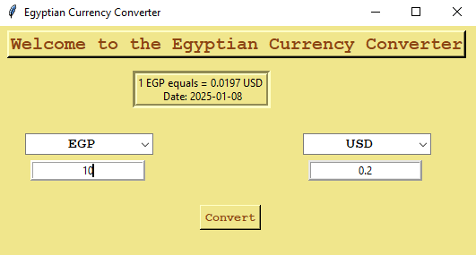
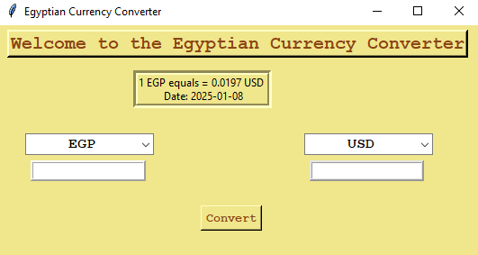

# Currency Converter in Python 💱

**By Aya Nabil**

## 🧐 About the Project

The **Currency Converter** is a simple yet powerful tool that helps you convert currencies in real-time. Built using Python, Tkinter, and the `requests` library, this project fetches live exchange rates from an API and allows you to convert between different currencies. It’s a perfect project for beginners to learn Python while building something practical and useful!

---

## 🌟 Why Use a Currency Converter?

In today’s globalized world, currency conversion is essential for travelers, online shoppers, and businesses. Instead of relying on manual calculations or outdated rates, this tool provides real-time exchange rates and instant conversions. By building this project, you’ll learn Python basics like **API integration**, **Tkinter GUI development**, and **error handling** while creating a tool you can use every day.

---

## 🧩 Features

- **User-Friendly GUI**: Built with Tkinter for a clean and intuitive interface.
- **Real-Time Exchange Rates**: Fetches live currency data from an API.
- **Customizable Currency Selection**: Choose from a wide range of currencies.
- **Error Handling**: Gracefully handles invalid inputs and API errors.
- **Beginner-Friendly**: Perfect for learning Python basics like functions, event handling, and API integration.

---

## 🛠️ Project Prerequisites

Before you start, ensure you have:

- **Basic Python Knowledge**: Familiarity with defining functions, handling user input, and working with dictionaries.
- **Python Installed**: Ensure Python 3.x is installed on your system.
- **Tkinter**: Usually comes pre-installed with Python.
- **requests**: Install it using `pip install requests`.

---

### Python Concepts Used

- **Tkinter**: For creating the graphical user interface (GUI).
- **requests**: To fetch live currency data from an API.
- **Functions**: To organize code and handle currency conversion.
- **Error Handling**: To manage invalid inputs and API errors.
- **Event Handling**: Responding to button clicks and user input.

---

## 📂 Project File Structure

Here’s a step-by-step breakdown of how this project works:

1. **Import Required Modules:**

   - `tkinter`: For creating the GUI (windows, buttons, labels, etc.).
   - `requests`: To fetch live currency data from an API.
   - `re`: To validate user input.

2. **Define Classes:**

   - `RealTimeCurrencyConverter`: Fetches live currency data and performs conversions.
   - `CurrencyConverterApp`: Handles the GUI and user interactions.

3. **Currency Conversion Logic:**

   - The user selects the "from" and "to" currencies using dropdown menus.
   - The user enters the amount to convert.
   - The program fetches the latest exchange rates and performs the conversion.
   - The converted amount is displayed in a label.

4. **Interactive GUI:**

   - Dropdown menus for selecting "from" and "to" currencies.
   - An `Entry` widget for entering the amount to convert.
   - A button to perform the conversion.
   - A label to display the converted amount.

---

## 🚀 How to Run the Project

1. **Clone or Download the Repository**:

   ```bash
   git clone https://github.com/1AyaNabil1/Basic-Python-Projects-for-Absolute-Beginners.git
   cd Basic-Python-Projects-for-Absolute-Beginners/05.\ Currency\ Converter
2. **Install Dependencies:**:

   ```python
   pip install requests
3. **Run the Script:**

   ```bash
   python currency_converter.py
4. **Follow the Prompts:**
    - Select the "from" and "to" currencies using the dropdown menus.
    - Enter the amount to convert in the `Entry` widget.
    - Click **Convert** to see the converted amount.
---

## 📸 Project Output

### Example Gameplay

1. **Main Window**:
   

2. **Converted Amount**:
   


---

## 📖 Summary

**With this project, you’ve learned how to:**
1. Create a simple GUI using Tkinter.

2. Fetch live data from an API using the `requests` library.

3. Perform real-time currency conversions.

4. Handle errors and validate user input.

5. Build a practical and interactive Python project from scratch.

---

## ✨ Credits

This project is proudly developed by `Aya Nabil`.

**Want to explore more beginner-friendly projects? Stay tuned! 😊**
