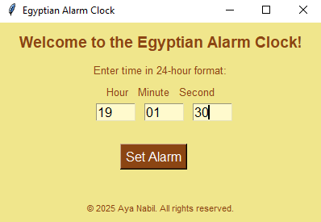
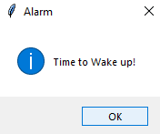

# Egyptian Alarm Clock in Python ⏰

**By Aya Nabil**

## 😎 About the Project

The **Egyptian Alarm Clock** is a simple yet functional alarm clock built using Python and Tkinter. This project allows users to set alarms with a user-friendly graphical interface, featuring a themed design inspired by Egypt. It's perfect for beginners to learn Python while building a practical and visually appealing application.

---

## 🌟 Key Features

- **Interactive GUI**: Built with Tkinter for a clean and intuitive interface.
- **Custom Alarm Sound**: Plays a sound when the alarm time is reached.
- **Real-Time Functionality**: Continuously checks the current time to trigger the alarm.
- **Error Handling**: Notifies the user about invalid inputs.
- **Themed Design**: Features an Egyptian-inspired color scheme.

---

## 🔧 Technologies Used

- **Python**: Core programming language for the project.
- **Tkinter**: For building the graphical user interface.
- **winsound**: To play the alarm sound (Windows only).
- **datetime**: For handling date and time operations.
- **time**: To manage delays in the alarm loop.

---

## 🚪 Prerequisites

Ensure you have the following installed:

- **Python 3.x**: Make sure Python is installed on your system.
- **Tkinter**: Pre-installed with most Python distributions.
- **winsound**: Works natively on Windows systems.

---

## 🎮 Project Features and Workflow

1. **Set Alarm Time**:
   - Enter the alarm time in 24-hour format (HH:MM:SS).
   - The GUI provides separate fields for hours, minutes, and seconds.

2. **Start the Alarm**:
   - Click the "Set Alarm" button to initiate the timer.
   - The program continuously checks the current time against the set alarm time.

3. **Trigger Alarm**:
   - When the current time matches the alarm, a sound plays, and a pop-up message notifies the user.

4. **Error Notifications**:
   - Invalid inputs trigger an error message, ensuring smooth user experience.

---

## 🔄 How to Run the Project

1. **Clone or Download the Repository**:

   ```bash
   git clone https://github.com/1AyaNabil1/Basic-Python-Projects-for-Absolute-Beginners.git
   cd Basic-Python-Projects-for-Absolute-Beginners/06.%20Alarm%20Clock
   ```

2. **Run the Script**:

   ```bash
   python alarm_clock.py
   ```

3. **Set the Alarm**:
   - Enter the desired alarm time in the fields provided.
   - Click **Set Alarm** to activate it.

---

## 🖼 Project Output

### Main Window

- The GUI features an Egyptian-inspired design with labels for hour, minute, and second inputs.
- Includes a "Set Alarm" button and a footer with copyright information.

<p align="center">
  
</p>

### Alarm Trigger

- Plays a sound (`sound.wav`) and displays a pop-up message when the alarm time is reached.

<p align="center">
  
</p>

---

## 📊 Summary

**With this project, you’ll learn how to:**

1. Create a themed GUI using Tkinter.
2. Work with Python’s `datetime` and `time` modules for real-time functionality.
3. Play custom sounds using `winsound`.
4. Handle user input validation and errors.
5. Build a functional and interactive Python project from scratch.

---

## ✨ Credits

This project is proudly developed by `Aya Nabil`.

**Stay tuned for more beginner-friendly projects and updates! 😊**
