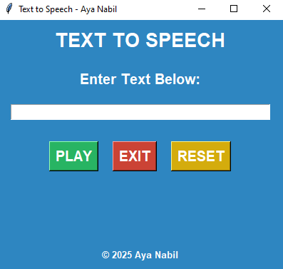

# Text to Speech Converter in Python 🎤

**By Aya Nabil**

## 😎 About the Project

The **Text to Speech Converter** is a fun and interactive project that transforms user input into speech. Using Python's Tkinter for the GUI and the Google Text-to-Speech (`gTTS`) library, this project demonstrates how to bring text to life. It's an excellent project for beginners looking to explore Python and speech synthesis!

---

## 🌟 Key Features

- **Interactive GUI**: Built with Tkinter for a simple and intuitive interface.
- **Speech Synthesis**: Converts text to natural-sounding speech using `gTTS`.
- **Audio Playback**: Plays the generated speech directly within the application.
- **Dynamic Controls**: Includes "Play," "Reset," and "Exit" buttons for smooth user interaction.
- **Themed Design**: Features an elegant blue interface.

---

## 🔧 Technologies Used

- **Python**: Core programming language for the project.
- **Tkinter**: For creating the graphical user interface.
- **gTTS**: To convert text to speech.
- **pygame**: For audio playback.
- **os & tempfile**: To handle temporary audio file storage.

---

## 🚪 Prerequisites

Ensure you have the following installed:

- **Python 3.x**: Make sure Python is installed on your system.
- **gTTS Library**: Install it using `pip install gTTS`.
- **pygame Library**: Install it using `pip install pygame`.

---

## 🎮 Project Features and Workflow

1. **Enter Text**:
   - Type the desired text into the input field.

2. **Convert to Speech**:
   - Click the "Play" button to convert text into speech and hear it instantly.

3. **Reset Input**:
   - Use the "Reset" button to clear the text field and start afresh.

4. **Exit Application**:
   - Click the "Exit" button to close the application.

---

## 🔄 How to Run the Project

1. **Clone or Download the Repository**:

   ```bash
   git clone https://github.com/1AyaNabil1/Basic-Python-Projects-for-Absolute-Beginners.git
   cd Basic-Python-Projects-for-Absolute-Beginners/07.%20Convert%20Text%20to%20Speech
   ```

2. **Install Dependencies**:

   ```bash
   pip install gTTS pygame
   ```

3. **Run the Script**:

   ```bash
   python text_to_speech.py
   ```

4. **Use the Application**:
   - Enter text in the input field.
   - Click **Play** to hear the text as speech.

---

## 🖼 Project Output

### Main Window

- An elegant blue GUI with an input field, buttons for "Play," "Reset," and "Exit," and a footer with your copyright.

<p align="center">
  
</p>

---

## 📊 Summary

**With this project, you’ll learn how to:**

1. Build a simple GUI using Tkinter.
2. Use `gTTS` for text-to-speech conversion.
3. Integrate audio playback with `pygame`.
4. Manage temporary files using `os` and `tempfile`.
5. Create an interactive and fun Python project.

---

## ✨ Credits

This project is proudly developed by `Aya Nabil`.

**Stay tuned for more beginner-friendly projects and updates! 😊**