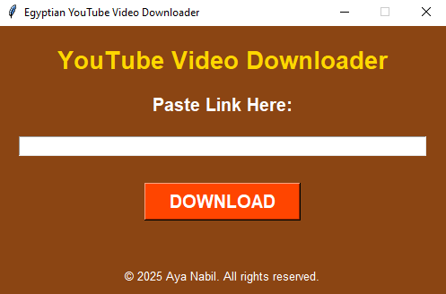

# Egyptian YouTube Video Downloader 🔗🎥

**By Aya Nabil**

## 😎 About the Project

The **Egyptian YouTube Video Downloader** is a simple yet effective tool to download YouTube videos directly to your device. With its user-friendly GUI and Egyptian-inspired design, it's perfect for anyone looking to save their favorite videos offline. This project is ideal for beginners to learn Python while building a practical and visually appealing application.

---

## 🌟 Key Features

- **Interactive GUI**: Built with Tkinter for an intuitive and clean interface.
- **Custom Download Location**: Allows users to choose where to save the downloaded videos.
- **Best Quality Downloads**: Automatically selects the highest available video quality.
- **Error Handling**: Provides clear messages for success, warnings, and errors.
- **Themed Design**: Features an earthy Egyptian-inspired color scheme.

---

## 🔧 Technologies Used

- **Python**: Core programming language for the project.
- **Tkinter**: For building the graphical user interface.
- **pytube**: To fetch YouTube video data.
- **yt-dlp**: For downloading videos with customizable options.

---

## 🚪 Prerequisites

Ensure you have the following installed:

- **Python 3.x**: Make sure Python is installed on your system.
- **pytube**: Install via pip: `pip install pytube`
- **yt-dlp**: Install via pip: `pip install yt-dlp`

---

## 🎮 Project Features and Workflow

1. **Paste Video Link**:
   - Copy the YouTube video link and paste it into the provided input field.

2. **Choose Download Location**:
   - Select a folder on your device where the video will be saved.

3. **Start Download**:
   - Click the "DOWNLOAD" button to begin downloading the video.

4. **Completion Notification**:
   - A success message pops up when the download is complete.

5. **Error Handling**:
   - Invalid or restricted links trigger error messages, ensuring a smooth user experience.

---

## 🔄 How to Run the Project

1. **Clone or Download the Repository**:

   ```bash
   git clone https://github.com/1AyaNabil1/Basic-Python-Projects-for-Absolute-Beginners.git
   cd Basic-Python-Projects-for-Absolute-Beginners/07.%20YouTube%20Downloader
   ```

2. **Run the Script**:

   ```bash
   python youtube_downloader.py
   ```

3. **Download Your Video**:
   - Paste the YouTube link, select a download location, and click **DOWNLOAD**.

---

## 🖼 Project Output

### Main Window

- The GUI features an Egyptian-inspired design with a text input field for the YouTube link, a vibrant download button, and footer copyright.

<p align="center">
  
</p>

---

## 📊 Summary

**With this project, you’ll learn how to:**

1. Create a themed GUI using Tkinter.
2. Utilize `pytube` and `yt-dlp` for YouTube video downloads.
3. Handle user inputs and errors effectively.
4. Build a functional and interactive Python project from scratch.

---

## ✨ Credits

This project is proudly developed by `Aya Nabil`.

**Stay tuned for more beginner-friendly projects and updates! 😊**
