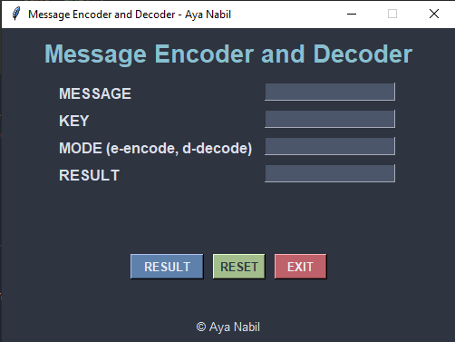

# Message Encoder and Decoder in Python 🔠🔐

**By Aya Nabil**

## 😎 About the Project

The **Message Encoder and Decoder** is a Python-based application with a modern GUI that allows users to securely encode and decode messages using a private key. It employs a simple substitution cipher combined with base64 encoding for added security. This project is ideal for beginners eager to learn Python and GUI development with a practical use case.

---

## 🌟 Key Features

- **Modern GUI**: Designed with Tkinter for a sleek, user-friendly interface.
- **Encoding and Decoding**: Securely encode messages and decode them using a private key.
- **Error Handling**: Graceful handling of invalid inputs and operations.
- **Reset and Exit**: Easy-to-use buttons for resetting inputs or exiting the app.

---

## 🔧 Technologies Used

- **Python**: Core programming language for the project.
- **Tkinter**: For building the graphical user interface.
- **Base64**: For encoding and decoding operations.

---

## 🚪 Prerequisites

Ensure you have the following installed:

- **Python 3.x**: Make sure to have Python installed on your machine. [Download Python](https://www.python.org/downloads/)

---
## 🖼 Project Output

### Main Window

<p align="center">
  
</p>

---
## ⏱ Usage Instructions

1. **Clone the Repository**:
    ```bash
    git clone https://github.com/1AyaNabil1/Basic-Python-Projects-for-Absolute-Beginners/blob/844be5cc73ee2956f211a05ba3db7a22aa49815c/09.%20Message%20Encode%20Decode
    cd %20Message%20Encode%20Decode
    ```

2. **Run the Application**:
    Execute the following command in your terminal:
    ```bash
    python encode_decode.py
    ```

3. **Enter Inputs**:
    - Enter the message you want to encode or decode.
    - Provide a private key.
    - Specify the mode: `e` for encode, `d` for decode.

4. **View Results**:
    - Click **RESULT** to see the output.
    - Use **RESET** to clear fields or **EXIT** to close the app.

---

## 🕵️ How It Works

1. **Encoding**:
    - Combines the message and private key using a substitution cipher.
    - Encodes the result in base64 format for secure representation.

2. **Decoding**:
    - Decodes the base64 string.
    - Reverses the substitution cipher using the private key.

---

## 🔧 Code Highlights

- **Encode Function**:
    ```python
    def encode(key, message):
        enc = []
        for i in range(len(message)):
            key_c = key[i % len(key)]
            enc.append(chr((ord(message[i]) + ord(key_c)) % 256))
        return base64.urlsafe_b64encode("".join(enc).encode()).decode()
    ```

- **Decode Function**:
    ```python
    def decode(key, message):
        decoded_message = base64.urlsafe_b64decode(message).decode()
        dec = []
        for i in range(len(decoded_message)):
            key_c = key[i % len(key)]
            dec.append(chr((256 + ord(decoded_message[i]) - ord(key_c)) % 256))
        return "".join(dec)
    ```

---

## 📅 Future Enhancements

- Add support for stronger encryption methods.
- Provide an option to save results to a file.
- Enhance the UI with additional themes and features.

---

## 🚀 Ready to Encode & Decode?

Get started now and make your message communication secure with ease! If you found this project helpful, feel free to star the repository and contribute. Happy coding! 😄


---

## 🔗 Resources

- [Python Documentation](https://docs.python.org/3/)
- [Base64 Module Documentation](https://docs.python.org/3/library/base64.html)
- [Tkinter Guide](https://docs.python.org/3/library/tkinter.html)

---
## ✨ Credits

This project is proudly developed by `Aya Nabil`.

**Stay tuned for more beginner-friendly projects and updates! 😊**
