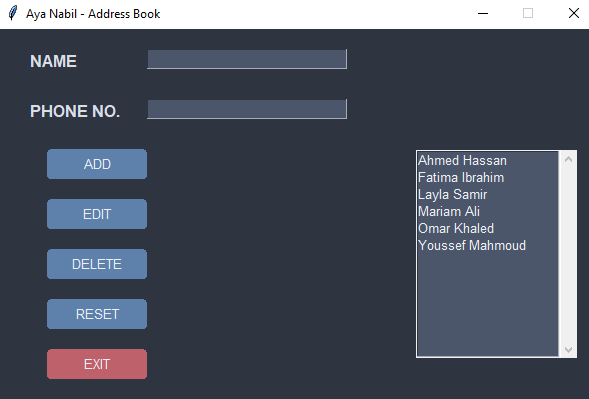

# Address Book in Python 📑🔐

**By Aya Nabil**

---

## 😎 About the Project

The **Address Book** is a Python-based GUI application that provides a simple yet effective way to manage and organize contact information. With a modern interface and intuitive features, it allows users to easily add, edit, view, and delete contacts, making it a perfect project for beginners diving into Python and GUI development.

---

## 🌟 Key Features

- **Modern GUI**: Built with Tkinter, featuring a sleek and user-friendly design.
- **Add/Edit/Delete Contacts**: Comprehensive contact management system.
- **View Contact Details**: Displays detailed information of selected contacts.
- **Reset and Exit**: Convenient buttons to reset fields or exit the application.
- **Interactive List**: Dynamic contact list with scroll functionality.

---

## 🔧 Technologies Used

- **Python**: Core programming language for the project.
- **Tkinter**: For building the graphical user interface.

---

## 🚪 Prerequisites

Ensure you have the following installed:

- **Python 3.x**: [Download Python](https://www.python.org/downloads/)

---

## 🖼 Project Output

### Main Window

<p align="center">
  
</p>

---

## ⏱ Usage Instructions

1. **Clone the Repository**:
    ```bash
    git clone https://github.com/1AyaNabil1/Basic-Python-Projects-for-Absolute-Beginners.git
    cd 10. Address Book
    ```

2. **Run the Application**:
    Execute the following command in your terminal:
    ```bash
    python address_book.py
    ```

3. **Manage Contacts**:
    - Use the **Add** button to add a new contact.
    - Select a contact and use **Edit** or **Delete** as needed.
    - Use **Reset** to clear input fields.
    - Click **Exit** to close the application.

---

## 🔍 How It Works

1. **Contact Management**:
    - Users can add contacts by entering a name and phone number.
    - The application sorts contacts alphabetically for easy navigation.

2. **Edit and Delete**:
    - Selected contacts can be updated or removed from the list.

3. **GUI Design**:
    - A modern, dark-themed interface ensures a smooth user experience.

---
## 🖼 Project Output

### Main Window

<p align="center">
  
</p>

---

## 📚 Code Highlights

- **Adding a Contact**:
    ```python
    def add_contact():
        name = name_var.get()
        number = number_var.get()
        if name and number:
            contact_list.append([name, number])
            update_list()
            reset_fields()
        else:
            messagebox.showwarning("Input Error", "Please fill in both fields!")
    ```

- **Updating the Contact List**:
    ```python
    def update_list():
        contact_list.sort(key=lambda x: x[0])
        select.delete(0, tk.END)
        for name, number in contact_list:
            select.insert(tk.END, name)
    ```

---

## 🕝 Future Enhancements

- Add functionality to save contacts to a database or file.
- Import and export contacts in CSV format.
- Enhance the UI with additional themes and features.
- Add search functionality to quickly find a contact.

---

## 🚀 Ready to Manage Contacts?

Get started now and take control of your contact management with ease! If you found this project helpful, feel free to star the repository and share your feedback. Happy coding! 😄

---

## 🔗 Resources

- [Python Documentation](https://docs.python.org/3/)
- [Tkinter Guide](https://docs.python.org/3/library/tkinter.html)

---

## ✨ Credits

This project is proudly developed by `Aya Nabil`.

**Stay tuned for more beginner-friendly projects and updates! 😊**
