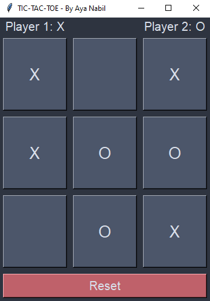

# Tic-Tac-Toe Game 🎮❌⭕  

**By Aya Nabil**  

## 😎 About the Project  

The **Tic-Tac-Toe Game** is a simple yet engaging Python game where two players take turns marking `X` and `O` on a 3x3 grid. The goal is to get three marks in a row, column, or diagonal before the opponent does. Built using **Tkinter**, this project serves as a great introduction to GUI-based game development in Python.  

---

## 🌟 Key Features  

- **Two-Player Mode**: Play with a friend in an interactive turn-based system.  
- **GUI-Based Gameplay**: Created using Tkinter for an intuitive and responsive experience.  
- **Winning Detection**: Automatically checks for a winner or a tie.  
- **Reset Button**: Restart the game at any time with a single click.  
- **Dark-Themed Interface**: Aesthetic UI design for a better user experience.  

---

## 🔧 Technologies Used  

- **Python**: The core programming language.  
- **Tkinter**: Used to design the graphical interface.  

---

## 🚪 Prerequisites  

Make sure you have Python installed:  

- **Python 3.x**: [Download Python](https://www.python.org/downloads/)  

Tkinter comes pre-installed with Python, so no additional installation is required!  

---

## 🔄 How to Run the Game  

1. **Clone the Repository**:  
    ```bash
    git clone https://github.com/your-repo-link/tic-tac-toe-game
    cd tic-tac-toe-game
    ```
2. **Run the Game**:  
    Execute the following command in your terminal:  
    ```bash
    python tic_tac_toe.py
    ```
3. **Play the Game**:  
    - Player 1 uses `X`, and Player 2 uses `O`.  
    - Take turns clicking the buttons on the 3x3 grid.  
    - The game announces the winner or declares a tie.  
    - Use the **Reset** button to play again.  

---

## 🕵️ How It Works  

1. **Game Board Setup**:  
    - A 3x3 grid is created using Tkinter buttons.  
    - Players are labeled as "Player 1: X" and "Player 2: O".  

2. **Player Turns**:  
    - Players take turns clicking an empty cell to mark it with `X` or `O`.  
    - The game alternates turns between the players.  

3. **Winning Logic**:  
    - The game checks if a player has aligned three of their marks in a row, column, or diagonal.  
    - If a win condition is met, the game announces the winner and exits.
    - If all cells are filled without a winner, the game declares a tie.

4. **Reset Button**:
    - Clicking the reset button clears the board and starts a new game.

---

## 🖼 Project Output

### Game Window

<p align="center">
  
</p>

---

## 🌋 Code Highlights

- **Winning Condition Check**:
    ```python
    def win(panels, sign):
        return (
            (panels[1] == panels[2] == panels[3] == sign) or
            (panels[4] == panels[5] == panels[6] == sign) or
            (panels[7] == panels[8] == panels[9] == sign) or
            (panels[1] == panels[4] == panels[7] == sign) or
            (panels[2] == panels[5] == panels[8] == sign) or
            (panels[3] == panels[6] == panels[9] == sign) or
            (panels[1] == panels[5] == panels[9] == sign) or
            (panels[3] == panels[5] == panels[7] == sign)
        )
    ```

- **Player Move Handling**:  
    ```python
    def checker(digit):
        global count, mark, digits

        if digit in digits:
            digits.remove(digit)
            mark = "X" if count % 2 == 0 else "O"
            panels[digit] = mark
            buttons[digit].config(text=mark)
            count += 1

            if win(panels, mark):
                msg.showinfo("Result", f"Player {mark} wins!")
                root.destroy()
            elif count > 8:
                msg.showinfo("Result", "Match Tied!")
                root.destroy()
    ```

---

## 📅 Future Enhancements  

- Add AI-powered single-player mode.  
- Implement score tracking for multiple rounds.  
- Improve the UI with animations and sound effects.  
- Save match history for players.  

---

## 🚀 Ready to Play?  

Download and run the game now to enjoy the classic Tic-Tac-Toe experience! If you like this project, feel free to star the repository and contribute. 😊  

---

## 🔗 Resources  

- [Python Documentation](https://docs.python.org/3/)  
- [Tkinter Documentation](https://docs.python.org/3/library/tkinter.html)  

---

## ✨ Credits  

This project is proudly developed by **Aya Nabil**.  

**Stay tuned for more exciting projects and updates! 🚀**  
